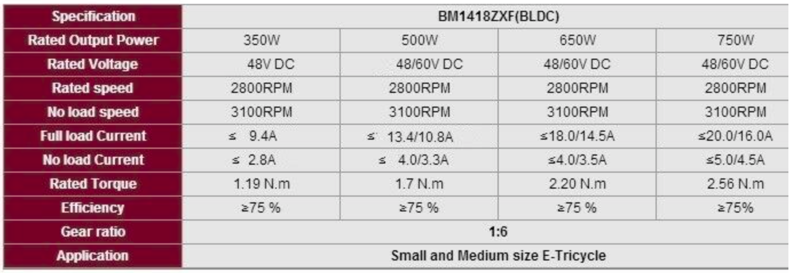
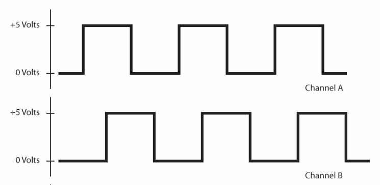
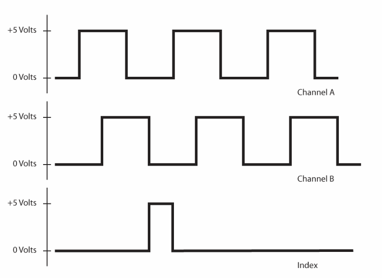

# Ebike motor control with Odrive

## System

* Components:
  * [Motor](https://robokits.co.in/motors/rhino-bldc-brushless-dc-motor/rhino-500w-48v-bldc-motors/e-bike-brushless-dc-geared-motor-1418zxf-48v-450rpm-500w-premium-quality)
  * [Encoder](https://robu.in/product/incremental-optical-rotary-encoder-6002400-pulse-600-ppr/?gclid=Cj0KCQjwteOaBhDuARIsADBqRehKD2c1UfEkCIlnOCUoueOt_9VB3B6uUJm6nF61DNErX2Io4MTwst8aAt4EEALw_wcB) 
  
### Motor (1418zxf)

* Velocity constant, $K_v = \frac{\omega_{no-load}}{V_{peak}}$ = $\frac{2800 * \frac{2\pi}{60}}{48}$ = $6.108$
* Torque constant, $K_T = \frac{\tau}{I_a} = \frac{1}{K_v}$ = $\frac{1}{6.108}$ = $0.164$
* no of pole pairs = 4
* integrated hall effect sensor cpr = {no of pole pairs} * {number of state in hall effect sensor} = 4 * 6 = 24

## Odrive

* Encoder
  + A, B phases are required and the Z (index) is optional.
  + Encoder without index signal
    + offset calibration on every startup.
  + Encoder with index signal
    + You can avoid doing the offset calibration on every startup.

* odrivetool
  + dev0 to know the current configuration.

## General

* 2 phase vs 3 phase encoder:
  + 2 phase encoder have 2 pahse A & B.
    + A leads B by 90 deg.
    + 
    
  + 3 phase encoder is a 2 phase encoder + index (Z)
    + index has 1 pulse per rotation.
    + index can be used to perform a homing move upon powering up.
    + 

  
