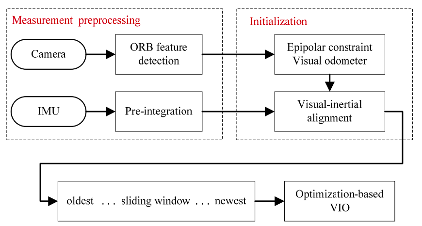
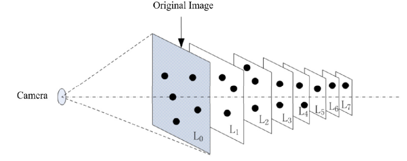
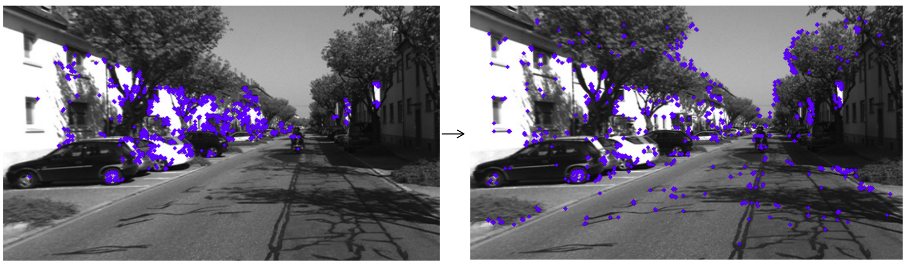

# A Vision-Inertial Odometer Design Based on ORB and Sliding Window
- Publication year: 2021

## Abstract
- Using **monocular camera** and **Inertial measurement unit**.
- Tightly coupled visual-inertial odometer system based on
  * sliding window
  * and nonlinear optimization

## Introduction

- The fusion of visual and inertial can be divided into
  * loosely coupled
  * tightly coupled
- Loose coupling can reduce the complexity of the system, but  accuracy is not as high as tightly coupled.

## System Introduction

### Overview

- Solution based on VINS-Mono.
- ORB feature detection algorithm for visual feature extraction.
- The information obtained by the IMU is pre-integrated to simplify the calculation.
- Then align the visual and inertial information.
- Use the bundle adjustment (BA) algorithm to optimize the sensor measurement residuals in the sliding window.

### Extract visual feature points

- For real time performance feature point extraction algorithm performance is very important.
- ORB (Oriented FAST and rotated BRIEF)
  * Solves the non-directional problem of the FAST algorithm.
  * Use binary descriptor BRIEF to make the feature matching faster.
  * Image pyramid for scale invariance.

- One problem with ORB feature extraction is that the feature points are not evenly distributed on the image.
  * To solve this problem this paper divides image of each scale into cells and extracts atleast 5 feature points on each cell.

* The steps for feature matching using ORB feature points are as follows: 
  1. Extract FAST corner points from the image.
  2. Use BRIEF descriptor to describe key corner points.
  3. Match the feature points according to the Hamming distance of descriptors.
  4. Filter matching results through RANSAC.

### Pure visual initialization
- IMU can make up for the lack of scale information in pure visual odometry, but IMU data contains noise and bias.
- In order to complete the system initialization better, the camera's pose estimation between two frames can be completed through epipolar constraints.
- Then using VO to correct the IMU bias and obtain the scale information to complete the system initialization.

### VIO based on sliding window
- After system is initialized the fusion of visual and inertial information is compleated.
- Then camera pose wil be estimated through VIO.
