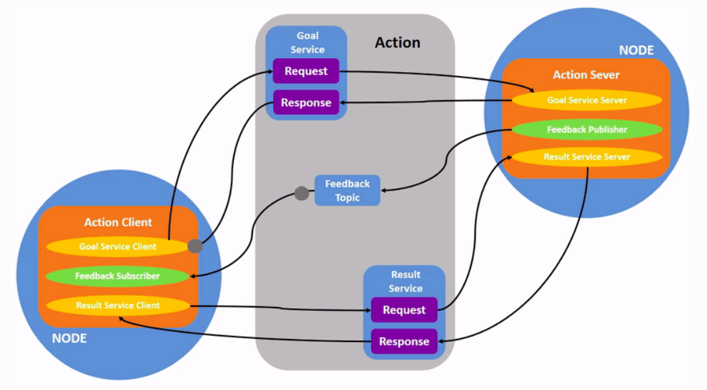

# ROS graph

## Understanding Node

* In ROS 2, a single executable (C++ program, Python program, etc.) can contain one or more nodes.

**Remapping:**
  * Remapping allows you to reassign default node properties, like node name, topic names, service names, etc., to custom values.

## Understanding parameters

- A parameter is a configuration value of a node. You can think of parameters as node settings.
- In ROS 2, each node maintains its own parameters.
- parameters are dynamically reconfigurable.

## Understanding actions

* Intended for long running tasks.
* They consist of three parts: a goal, feedback, and a result.

## Launching nodes

* ROS 2 launch files can be written in Python, XML, and YAML.

## ros2 bag

* ros2 bag uses sqlite3 by default.
