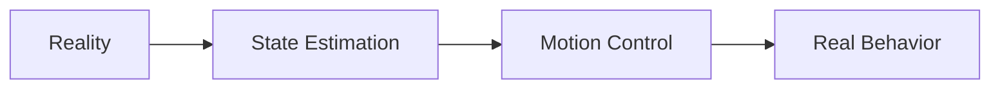
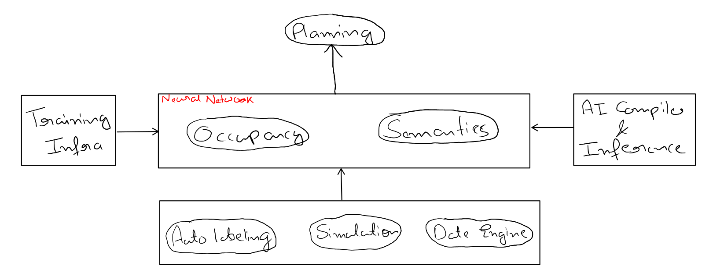

# Tesla AI Day

**Battery Pack:**
* cells + integrated electronics

**Bot Brain:**
* SoC + WiFi + LTE + Audio + Security & Safety

* 4 bar linkage at knee.

* 6 diff actuator in entire tesla bot.
  * 3 rotary actuator
    + Mechanical clutch on high speed side
    + [Strain wave gearing i.e. harmonic gearing](https://en.wikipedia.org/wiki/Strain_wave_gearing)
    + Sensors: 
      [Input] --> [motor] --> [Gear reduction] --> [Output]
      + Input position sensor
      + Output position sensor
      + non-contacttorque sensor
  * 3 linear actuator

**Visual Odometry:**
- NN to identify high hz features (i.e. keypoints) within the bots camera stream and track then access frames over time as the bot navigates.

**Walking:**
* Physical self-awareness.
* Energy-Efficient Gait.
  + **Gate:** Pattern of limb movement made during locomotion.

## Tesla FSD

**Planning:**
- Car is not localized, but vector space is built around the car and planning(local plan) is done in that vector space.

**Occupancy:**
- Multicamera video neural network that from the images predict the full physical occupancy of the world around the robot.
- Plus there future motion.
- For every 3d location, it predicts the probabiility of whether it is occupied or not.
- Video context.

**Auto labeling:**
- High precision trajectory recovery by using visual inertial odometry.
  * All features are infured from video by neural network.
  * Then tracked and reconstructed in vector space.
- Multi-Trip Reconstruction

**Simulation:**
* Simulation generated with real world data.

**DOJO:**
* High speed connectivity.
